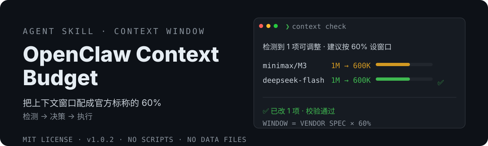

# OpenClaw Context Budget 🎛️

<div align="center">
  <a href="README.md">🇨🇳 中文</a> | <strong>🌐 English</strong>
</div>

<p align="center">
  
</p>

> Context optimization, in one pass: it enumerates the models currently enabled in your installation, fetches each vendor's latest published context length, proposes **60%** of it — and writes the config only after you return a single digit.
> OpenClaw context check / context optimization: detect → decide → apply, with official sources, no scripts, no data files.


[](https://clawhub.ai/dtsola/skills/xiaoyaoclaw-context-budget)

## Why you need it

Context windows vary a lot between vendors (200K, 1M, …), and when a model has no declared window OpenClaw falls back to a **built-in default**. That leads to:

- 📉 **Window underestimated** — context gets **compacted too early**, long tasks get cut off, compaction stalls
- 📈 **Window overestimated** — the model **loses focus** in very long context, answer quality drops
- 🧾 **No provenance** — nobody can tell where the number in the config came from
- 🧮 **Manual math** — the "keep 60% headroom" rule has to be converted into absolute tokens, per model

Doing it by hand means: open each vendor's docs → multiply by 60% → edit config → reload → verify. **This skill turns that into one check and one digit.**

## Features

- 🎯 **One fixed best practice** — effective window = vendor spec × **60%** (headroom against attention dilution)
- 🔎 **Dynamic enumeration** — the model list is **read from the live config** (models in use, plus sidecar models like image/PDF); nothing hard-coded
- 🌐 **Official sources** — fetches the **latest** published window from vendor docs/APIs each run; source and fetch time appear on the decision card
- 1️⃣ **One-digit confirmation** — flow = detect (automatic) → decide (one digit) → apply (automatic); no docs to read
- 🧱 **Window fields only** — `maxTokens` and every other parameter, plus compaction thresholds (left at system default), are **never touched**
- 🕊️ **No trail** — no audit files, no history list; only the previous values of the fields being changed are recorded for one-step rollback (single overwrite)
- 📦 **Instruction-only** — no scripts, no data files, no third-party dependencies; consistent across install shapes
- ↩️ **Rollback** — one command undoes the last adjustment (writes the recorded old values back)
- 🛡️ **Transparent writes** — **window fields only**; writes happen **only after your confirmation** (reply `1`) via `config.patch`; it does **not restart the runtime or clear session state on its own** (it only suggests); live state is verified afterwards and mismatches are reported
- 🔒 **Network reads only** — visits vendor official sources to read the published window; never uploads local data
- ⏱️ **No automation baked in** — the skill creates no scheduled jobs; the cron example is an opt-in you configure yourself

## Install

```bash
# ClawHub (recommended)
clawhub install xiaoyaoclaw-context-budget

# Or install from GitHub manually
git clone https://github.com/dtsola/xiaoyaoclaw-context-budget
# Put SKILL.md into your skills directory
```

## Usage

1. Put the skill into your OpenClaw skills directory
2. Tell your agent: **"context optimization"** / "context check" / "上下文优化" / "configure the context window"
3. The agent detects → shows a decision card → you reply `1` to adopt → it applies, verifies, and reports three lines

Trigger phrases (plain language is enough): 上下文优化 / 上下文检查 / 检查上下文 / 优化上下文 / 上下文窗口检查 / 上下文体检 / "context check" / "context optimization"
Slash command: `/xiaoyaoclaw-context-budget`

## 🚀 Quick start (3 steps, 1 minute)

### Step 1: Install the skill

```bash
clawhub install xiaoyaoclaw-context-budget
```

Your agent gains a "context optimization" capability. No API key needed.

### Step 2: Say one sentence

> context optimization

The agent will: ① enumerate the models **in use** → ② fetch each vendor's latest published window from official sources (~30–60 s) → ③ show a decision card:

```
🎛️ 1 item can be adjusted
· <provider>/<model> (in use) ｜ vendor spec 1,000,000 ｜ current 200,000 → suggest 600,000
· <provider>/<model> (in use) ｜ vendor spec 1,000,000 ｜ current 600,000 ✅ no change
Reply 1 to adopt ｜ 2 to keep current ｜ 3 for details
```

### Step 3: Return one digit

Reply `1` → it writes the config, triggers the reload, verifies, and reports:

```
✅ 1 item updated: <provider>/<model> 200,000 → 600,000
Verified (window is live)
To revert, reply "undo last context adjustment"
```

### Daily habits

| Situation | What to do |
|---|---|
| First-time setup / periodic check | Say "context optimization", read the card, reply one digit |
| Added / switched a model | Say "I switched models, configure the window" — only the new model gets a card |
| Want a different ratio | Say "context optimization, use 50%" (default 60%) |
| Suspect long tasks are cut off | Say "context optimization" — it checks first, then concludes (no blind change) |
| Changed your mind | Say "undo last context adjustment" |
| Periodic self-check (optional) | Schedule it yourself via cron: **silent** when nothing changed; pings you only when a vendor updates a window |
| Look but don't apply | Reply `2` (zero changes) or `3` for details |

## vs. manual configuration

| | Manual docs + hand-editing | **xiaoyaoclaw-context-budget** |
|---|---|---|
| Fetching | Browsing each vendor's docs from memory | ✅ Latest value from official sources, with source and time |
| Math | Multiplying by 60% by hand | ✅ Computed automatically; ratio can be overridden per run |
| Coverage | Often misses sidecar models (image/PDF) | ✅ Dynamically enumerates in-use and sidecar models |
| Verification | Trust your feelings | ✅ Verifies live state after writing, reports any mismatch |
| Failure cost | You don't know the previous value | ✅ One command to roll back |
| Blast radius | Easy to touch unrelated parameters | ✅ Window fields only |

## Project layout

```
xiaoyaoclaw-context-budget/
├── SKILL.md                    # Skill body (rules / detect-decide-apply / self-checks / triggers)
├── assets/readme/
│   ├── hero.svg                # README cover (pure SVG)
│   └── community-qr.png        # community group QR code
├── docs/
│   ├── DESIGN.md               # Design doc (mechanism evidence / rules / flow / boundaries)
│   ├── INTERACTION.md          # User-facing interaction flow
│   ├── TRIGGERS.md             # Trigger phrases and anti-triggers
│   └── EVAL-2026-09-14.md      # First end-to-end evaluation record
├── README.md / README.en.md
└── LICENSE
```

## License

MIT — use it freely; attribution optional.

---

## 🛠️ Need customization?

**Agent & Skills customization, from ¥800.**

- WeChat: `dtsola` (mention **openclaw定制** when adding)
- Scope: OpenClaw multi-agent deployment / workspace standardization / custom skill development / agent memory systems / knowledge bases

## 💬 Community

Xiaoyao product user group — feedback · tips · feature requests:

<p align="center">
  
</p>

<p align="center">Scan to join, or add WeChat <code>dtsola</code> (note: <b>加群</b>)</p>

## Sister projects

- 🏠 **xiaoyaoclaw-workspace-initializer** — give every agent a proper "home": standard layout + WORKSPACE.md rules + multi-agent config safety. <https://github.com/dtsola/xiaoyaoclaw-workspace-initializer>
- 🧠 **xiaoyaoclaw-memory-distill** — distill conversations into MEMORY.md + daily logs; solves context overflow. <https://github.com/dtsola/xiaoyaoclaw-memory-distill>
- 🗂️ **xiaoyaoclaw-task-progress-tracker** — directory as container, PROGRESS.md as progress; lifecycle for tasks/ and projects/. <https://github.com/dtsola/xiaoyaoclaw-task-progress-tracker>
- 📚 **xiaoyaoclaw-kb-retriever** — local knowledge-base retrieval with a layered index and progressive search (md/pdf/xlsx). <https://github.com/dtsola/xiaoyaoclaw-kb-retriever>
- 📎 **xiaoyaoclaw-web-clipper** — save any web page as clean local Markdown with frontmatter; dual-engine extraction, CJK-safe filenames. <https://github.com/dtsola/xiaoyaoclaw-web-clipper>
- 🤝 **xiaoyaoclaw-agent-orchestrator** — multi-agent orchestration layer: split, dispatch, track, aggregate, retry. <https://github.com/dtsola/xiaoyaoclaw-agent-orchestrator>
- 📊 **xiaoyaoclaw-usage-report** — parse session JSONL: task duration, tools/skills/models used, token consumption. <https://github.com/dtsola/xiaoyaoclaw-usage-report>
- 🩺 **xiaoyaoclaw-workspace-auditor** — read-only workspace health check with a graded report and fix suggestions. <https://github.com/dtsola/xiaoyaoclaw-workspace-auditor>
- 🎛️ **xiaoyaoclaw-commander** — let any Agent Skills host (Claude Code / Codex / OpenCode / Trae / DSH) command an OpenClaw multi-agent system. <https://github.com/dtsola/xiaoyaoclaw-commander>
- 🔍 **xiaoyaoclaw-seo-skill** — site search-visibility analysis: audit / page / content / schema / geo workflows. <https://github.com/dtsola/xiaoyaoclaw-seo-skill>
